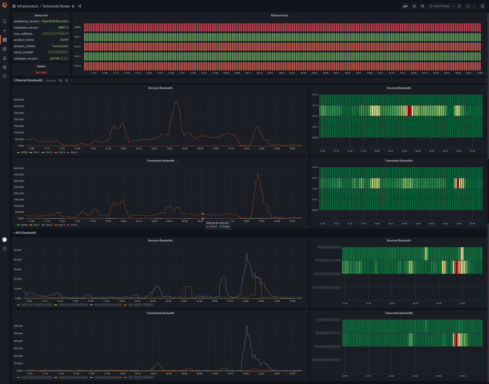

# technicolor-prometheus-exporter
A prometheus exporter for the Technicolor Router (Tim Hub)

This is an early version of the exporter. 

---

It is not ready for production use.
---


This is highly inspired by [pytechnicolor](https://github.com/shaiu/techicolorgateway) for the scraping part.

## Grafana Dashboard

A dashboard is available in the `extra` folder.



## Example of deployment in Kubernetes

The secret:

```yaml
apiVersion: v1
kind: Secret
metadata:
    name: technicolor-password
    namespace: monitoring
type: Opaque
data:
    password: <password>
``` 

The deployment:

```yaml
apiVersion: apps/v1
kind: Deployment
metadata:
  namespace: monitoring
  name: technicolor-exporter
  labels:
    app: technicolor-exporter
spec:
  replicas: 1
  selector:
    matchLabels:
      app: technicolor-exporter
  template:
    metadata:
      labels:
        app: technicolor-exporter
    spec:
      imagePullSecrets:
      - name: registry-credentials
      containers:
      - name: technicolor-exporter
        image: andreee94/technicolor-prometheus-exporter:0.0.3
        ports: 
          - name: exporter-port
            containerPort: 9182
        env:
          - name: TECHNICOLOR_IP
            value: "192.168.1.1"
          - name: TECHNICOLOR_PORT
            value: "80"
          - name: TECHNICOLOR_USERNAME
            value: admin
          - name: TECHNICOLOR_PASSWORD
            valueFrom:
              secretKeyRef:
                name: technicolor-password
                key: password
        resources:
          requests:
            cpu: "25m"
            memory: "32Mi"
          limits:
            cpu: "100m"
            memory: "128Mi"
```

The service:

```yaml
apiVersion: v1
kind: Service
metadata:
  namespace: monitoring
  name: technicolor-exporter
  labels:
    app: technicolor-exporter
spec:
  type: ClusterIP
  selector:
    app: technicolor-exporter
  ports:
  - name: technicolor-exporter-port
    port: 9182
    targetPort: exporter-port
```

The service monitor (Compatible with the prometheus-operator):

```yaml
---
apiVersion: monitoring.coreos.com/v1
kind: ServiceMonitor
metadata:
  name: technicolor-exporter-service-monitor
  namespace: monitoring
  labels:
    app.kubernetes.io/part-of: kube-prometheus-stack
spec:
  endpoints:
  - port: technicolor-exporter-port
    interval: 60s
    scheme: http
  selector:
    matchLabels:
      app: technicolor-exporter
  namespaceSelector:
    matchNames:
    - monitoring
```
